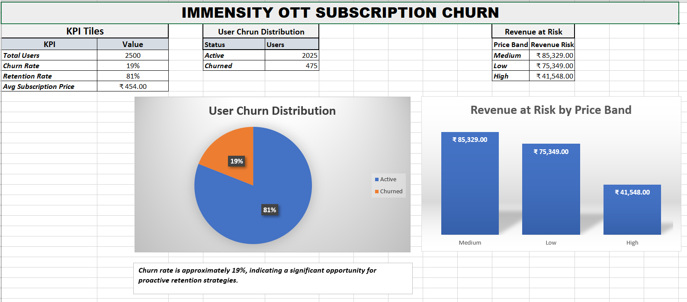

# Subscription Churn Early-Warning & Retention Strategy

## Project Overview
This project analyzes subscriber churn for a simulated OTT platform called Immensity. 
The goal is to identify early warning signals of churn, build a predictive model, and 
recommend targeted retention strategies.

## Dashboard Preview

## Key Features
- Python ETL pipeline for cleaning and transforming subscription data
- Cohort retention and segmentation analysis
- Churn driver investigation using engagement metrics
- Machine learning models (Logistic Regression, Random Forest)
- Revenue at risk estimation
- Executive dashboard for business insights

## Model Performance
ROC-AUC: ~0.92  
Accuracy: ~89%

## Key Insight
Users who churn show a significant decline in engagement prior to cancellation, making usage decline a strong early warning signal.

## Tools Used
Python, Pandas, NumPy, Scikit-learn, Matplotlib, Jupyter Notebook, Excel

## Project Structure
Business Problem
↓
Data Engineering
↓
Exploratory Analysis
↓
Machine Learning
↓
Business Strategy

## Business Impact
The analysis identified high-risk churn segments and estimated revenue exposure across subscription plans.  
Early detection of churn enables proactive retention campaigns, helping protect recurring subscription revenue.

